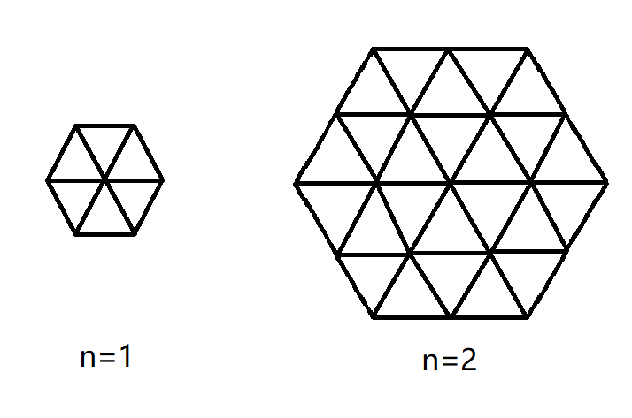

## Problem D: Hexagon Cost

Time Limit: 2 Sec Memory Limit: 1024 MB

## Description

There a big hexagon, the side length is $n$, so there are $3n^2+3n+1$ points, and $9n^2+3n$ edges. Each point has a weight.

We define the weight of each edge as the multiplying result of the weight of two endpoints in it. Please find out the minimum cost to connect these $3n^2+3n+1$ points.



## Input

The first line contains an integer $n(1≤n≤200)$, indicating the edge length of the hexagon. 

The next $2n+1$ lines, line i contains $2n+1−|i−n−1|$ integers $w(1≤w≤10^6)$, indicating the weight of each node.

## Output

Output the minimum cost in one line.

## Sample Input

```
1
2 2
2 1 2
2 2
```

## Sample Output

```
12
```
