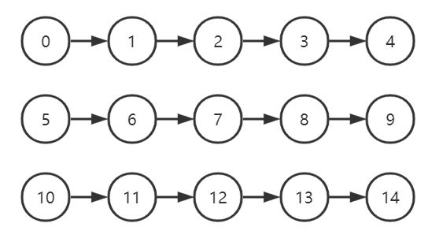
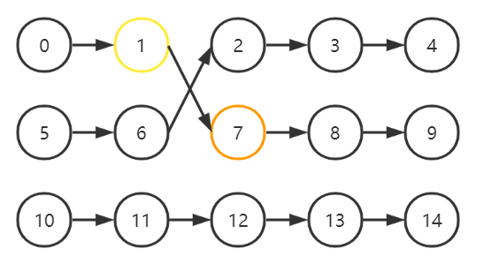

## Problem G: Exchange

Time Limit: 1 Sec Memory Limit: 128 MB

## Description

Give you $n$ linkedlists, each with $m$ numbers inside. The chains index are numbered $0$ to $(n-1)$, and the nodes on the initial $i$-th chain are numbered $(i·m) , (i·m+1) ...... (i·m+(m-1))$

After that you are given $k$ operations, each operation will select two node numbers $a,b$. Disconnect the right side of $a$ and the left side of $b$ on the current linkedlist into four parts, then join $a$ and $b$ together and join the remaining two disconnected parts together.

For example, $n=3,m=5$. If you choose $a,b=1,7$ then the result after reconnection is $[5,6,2,3,4]$ and $[0,1,7,8,9]$





After these operations, ask for all the nodes of the linkedlist where node $x$ is located and output them from left to right.

## Input

First line 4 numbers : $n, m, k, x (n·m＜1e6 , 0＜k＜2e5)$

Then follow $k$ lines, each line two numbers: $a,b(0≤a,b＜n·m)$ meaning the nodes selected

It is guaranteed that the two nodes selected each time are not currently in the same chain

## Output

A line containing a lot of numbers of all the index of nodes in the linkedlist where node $x$ is located and output them from left to right.

## Sample Input

```
3 5 1 0
1 7
```

## Sample Output

```
0 1 7 8 9
```

## HINT

Bonus lab
