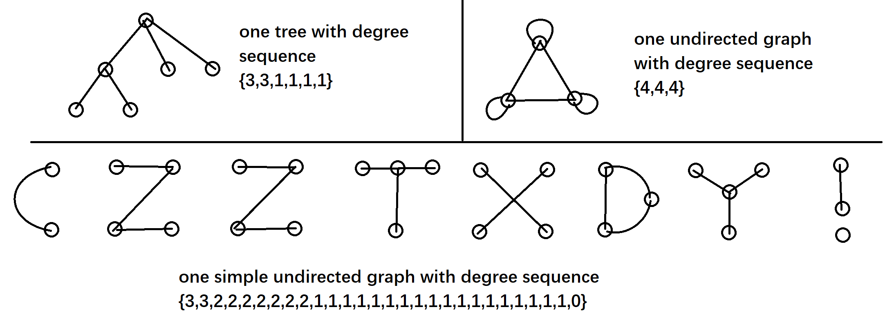

## Problem D: Trivial Graph Problem

Time Limit: 1 Sec Memory Limit: 128 MB

## Description

Given an array $a_1,a_2,...,a_n$ which means the degree of nodes.
Satori wants to know if there is an undirected graph/a simple undirected graph/a tree whose sequence of degrees = array a.



## Input

The first line contains an integer $n(1≤n≤10^5)$, i.e. the number of nodes.
Then one line follows. It contains $n$ integers $a_i≤10^7$, which means the degree of node $i$ is $a_i$.

## Output

The first line print "`YES`"(without quotes) if there is an undirected graph whose sequence of degrees = array a, and "`NO`"(without quotes) otherwise.
The second line print"`YES`"(without quotes) if there is a simple undirected graph whose sequence of degrees = array a, and "`NO`"(without quotes) otherwise.
The third line print"`YES`"(without quotes) if there is a tree whose sequence of degrees = array a, and "`NO`"(without quotes) otherwise.

## Sample Input

```
6
3 3 1 1 1 1
```

## Sample Output

```
YES
YES
YES
```
